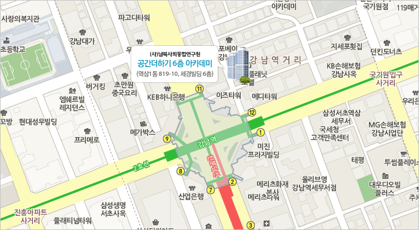

# 제10회 한국 리눅스 커널 개발자 모임

* 날짜: 2025. 9. 18 (목)
* 시간: 오후 7시 ~ 9시 50분
* 장소: 서울시 강남구 테헤란로1길 10 세경빌딩 6층 공간더하기(강남역 11번 출구 근처)

## 일정

| 시간 | 형식 | 제목 | 발표자 |
|----|----|----|----|
| 19:00 | | 모임 소개 | 사회자 |
| 19:05 | Main | [Kernel Report](main-01/) | 이경식 |
| 19:25 | Half | [Device Memory TCP 를 통한 효율적인 데이터 전송](half-01/) | 문연수 |
| 19:40 | Half | [시스템 관리자를 위한 커널 공격 표면 파악: 주요 CVE 사례와 검증 노하우](half-02/) | 김현우 |
| 19:55 | break time | | |
| 20:10 | Half | [산업에서의 리눅스커널 제품화와 업스트림](half-03/) | 민찬호 |
| 20:25 | Half | [Zombie Memory Cgroup 이슈와 논의 중인 해결 방안](half-04/) | 유형곤 |
| 20:40 | Lightning | [운영체제의 기본 옵션에는 컨테이너가 있어요](lightning-01/) | 차주형 |
| 20:46 | Lightning | [리눅스 커널의 양자 컴퓨팅 시대에 맞는 암호(PQC) 대비](lightning-02/) | 이파란 |
| 20:52 | Lightning | [Shallow dive into Linux kernel fuzzing with syzkaller](lightning-03/)| 장선우 |
| 21:00 | networking time (다과) | |

발표가 끝나고 오후 9시 50분까지 간단한 다과를 하면서 참석자들이 자유롭게 대화를 나눠보는 시간을 마련할 예정입니다.

## 참석 신청
[https://event-us.kr/klkd/event/110462](https://event-us.kr/klkd/event/110462) 
작년까지 사용하던 festa.io 가 서비스를 중단함에 따라 참석 신청 사이트를 부득이 변경하였습니다. 

## 약도

## 후원
미정
