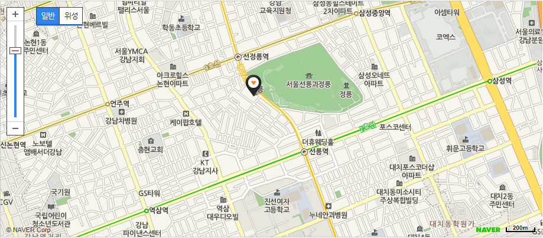

# 제2회 한국 리눅스 커널 개발자 모임

* 날짜: 2017. 7. 6 (목)
* 시간: 오후 7시 ~ 10시
* 장소: [D.CAMP](http://dcamp.kr) 6층 다목적홀

(주차는 지원되지 않습니다)

## 일정

| 시간 | 형식 | 제목 | 발표자 |
|----|----|----|----|
| 7시~ |  main topic | [Lockdep(Lock Dependency) Mechanism](session-01/) | 박병철 |
| 7시40분~ |  main topic | [SMB Network Filesystem](session-02/)| 전남재 |
| 8시30분~ |  lightning talk | [리눅스 커널 커뮤니티 소개](lightning-01/) | 김남형 |
| 8시45분~ |  lightning talk  | [Brief introduction to kernel selftest](lightning-02/) | 박성재 |
| 9시~ | discussion | 자유 토론 | 김민찬 |

## 발표 신청
발표 신청이 마감되었습니다. 시간 관계 상 모든 분들께 기회를 드리지 못하였음을 죄송하게 생각합니다.
다음 기회에 함께할 수 있기를 바라겠습니다.

## 참석 신청
모임이 종료되었습니다. 다음 모임 기회를 이용해 주세요~

[onoffmix link](http://onoffmix.com/event/99896)

## 후원
* LG전자: 다과 및 발표자 선물 지원

