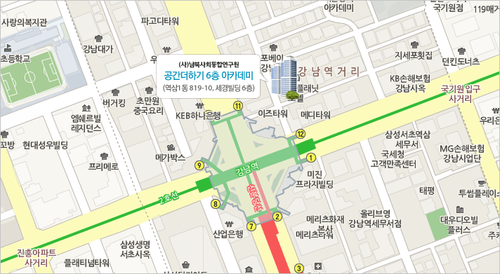

# 제8회 한국 리눅스 커널 개발자 모임

* 날짜: 2023. 9. 14 (목)
* 시간: 오후 7시 ~ 9시 50분
* 장소: 서울시 강남구 테헤란로1길 10 세경빌딩 6층 공간더하기(강남역 11번 출구 근처)

## 일정

| 시간 | 형식 | 제목 | 발표자 |
|----|----|----|----|
| 19:00 | | 모임 소개 | |
| 19:05 | main topic | [kernel report](session-01/) | 김동현 |
| 19:30 | lightning talk | [Linux & Xen For \\ Functional Safety & Security Critical System (feat: Automotive)](lightning-01) | 이파란 |
| 19:45 | lightning talk | [eBPF 를 활용한 memory leak sanitizer](lightning-02) | 서보준 |
| 20:00 | break time | | |
| 20:10 | main topic | [Linux Kernel Hacking (From user to root privileges)](session-02) | 김현우 |
| 20:45 | lightning talk | [USBNET 프레임워크 최적화 리뷰](lightning-03) | 안이수 |
| 21:00 | networking time (다과) | |

발표가 끝나고 오후 9시 50분까지 간단한 다과를 하면서 참석자들이
자유롭게 대화를 나눠보는 시간을 마련했습니다.

## 참석 신청
[festa link](https://festa.io/events/3901)

## 약도

## 후원
* LG전자: 장소 대여비 및 네트워킹 시간 간식 지원
* SK hynix: 간식 지원
* 알티스트: 간식 박스 및 발표자에게 판촉물 우산
