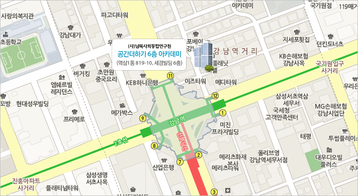

# 제9회 한국 리눅스 커널 개발자 모임

* 날짜: 2024. 9. 5 (목)
* 시간: 오후 7시 ~ 9시 50분
* 장소: 서울시 강남구 테헤란로1길 10 세경빌딩 6층 공간더하기(강남역 11번 출구 근처)

## 일정

| 시간 | 형식 | 제목 | 발표자 |
|----|----|----|----|
| 19:00 | | 모임 소개 | |
| 19:05 | main topic | [kernel report](session-01) | 이현철 |
| 19:35 | lightning talk | [구글 클라우드 서버의 커널을 해킹해 상금을 받아보자 (Google KernelCTF)](lightning-01) | 김현우 |
| 19:50 | lightning talk | [Realtime 성능을 보장할 수 있는 어플리케이션 코드 작성을 위한 Coding Guideline](lightning-02) | 황재호 |
| 20:05 | break time | | |
| 20:15 | main topic | [LUF(Lazy Unmap Flush) 메커니즘 소개](session-02) | 박병철 |
| 20:45 | lightning talk | [Recent Android kernel trend for device longevity](lightning-03) | 남영민 |
| 21:00 | networking time (다과) | |

발표가 끝나고 오후 9시 50분까지 간단한 다과를 하면서 참석자들이
자유롭게 대화를 나눠보는 시간을 마련했습니다.

## 참석 신청
[festa link](https://festa.io/events/5756)

## 약도

## 후원
* LG 전자: 장소 대여비 및 네트워킹 시간 간식
* 알티스트: 간식 박스
* SK hynix: 발표자 선물
